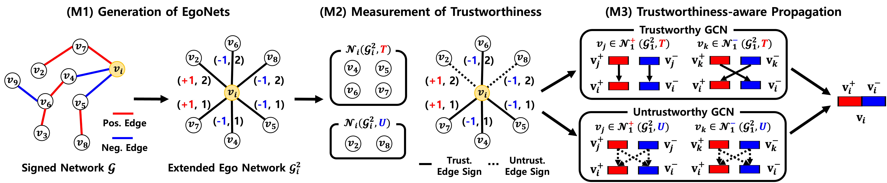

# TrustSGCN: Learning Trustworthiness on Edge Signs for Effective Signed Graph Convolutional Networks



This repository provides a reference implementation of TrustSGCN as described in the following paper "[TrustSGCN: Learning Trustworthiness on Edge Signs for Effective Signed Graph Convolutional Networks](https://doi.org/10.1145/3539618.3592075)", published at SIGIR 2023. (46th International ACM SIGIR Conference on Research and Development in Information Retrieval (ACM SIGIR 2023))

## Authors
- Min-Jeong Kim (kmj0792@hanyang.ac.kr)
- Yeon-Chang Lee (yeonchang@gatech.edu)
- Sang-Wook Kim (wook@hanyang.ac.kr)

## Input
The input dataset should be saved in ```./experiment-data/``` folder. 

The structure of the input dataset is the following: ```| node_id1 | node_id2 | sign |```

Node ids start from 0 to |*V*|-1 (*V* is the set of nodes in the dataset).

## Output
The outputs of ```countTRI``` function are saved in ```./count_triangle/``` folder. 

The outputs of ```extract```, ```setsubgraph```, ```predict```, ```setproMTX``` functions are saved in ```./features/``` folder. 

The node embeddings generated through the training process are saved in the  ```./embeddings/trustsgcn-{args.agg}``` folder. 

The accuracies of TrustSGCN are saved in ```./embeddings/trustsgcn-{args.agg}/result``` folder. 

## Arguments
#### For pre-processing (in ```argument.py```)
```
--dataset                 Dataset name. (default: "bitcoin_alpha")
--hop                     Maximum hop count to include in EgoNets. (default: 2)
--percent                 Sparsity setting (80, 60, 40, 20). (default: 80)
--p_thres                 Positive threshold (beta_+). (default: 0.98)
--n_thres                 Negative threshold (beta_-). (default: 0.98)
--func                    Select a function of (countTRI, extract, setsubgraph, predict, setproMTX) (default: "setproMTX")
```

#### For embedding propagation (in ```trustsgcn.py```)
```
--dataset                 Dataset name. (default: "bitcoin_alpha")
--hop                     Maximum hop count to include in EgoNets. (default: 2)
--percent                 Sparsity setting (80, 60, 40, 20). (default: 80)
--sample_num              Random sampling num (bitcoin_alpha: 30, bitcoin_otc: 30, slashdot: 20, epinions: 10).
--p_thres                 Positive threshold (beta_+). (default: 0.98)
--n_thres                 Negative threshold (beta_-). (default: 0.98)
```

## Procedure
1. Obtain the ratios of balanced/unbalanced triads (```pre_analysis``` percentage).
2. Extract 23 topological features from the train dataset.
3. Generate the target node's extended EgoNet.
4. Predict the edge sign and confidence scores between two nodes using 23 topological features.
5. Measure the trustworthiness of edge signs in the EgoNet using two conditions.
6. Perform different embedding propagations (trustworthy or untrustworthy).

## Basic Usage
```
1. Obtain the ratios of balanced/unbalanced triads (pre_analysis percentage).
python preprocessing.py --dataset=bitcoin_alpha --hop=2 --percent=80 --p_thres=0.98 --n_thres=0.98 --func=countTRI

2. xtract 23 topological features from the train dataset.
python preprocessing.py --dataset=bitcoin_alpha --hop=2 --percent=80 --p_thres=0.98 --n_thres=0.98 --func=extract

3. Generate the target node's extended EgoNet.
python preprocessing.py --dataset=bitcoin_alpha --hop=2 --percent=80 --p_thres=0.98 --n_thres=0.98 --func=setsubgraph

4. Predict the edge sign and confidence scores between two nodes using 23 topological features.
python preprocessing.py --dataset=bitcoin_alpha --hop=2 --percent=80 --p_thres=0.98 --n_thres=0.98 --func=predict

5. Measure the trustworthiness of edge signs in the EgoNet using two conditions.
python preprocessing.py --dataset=bitcoin_alpha --hop=2 --percent=80 --p_thres=0.98 --n_thres=0.98 --func=setproMTX

6. Perform different embedding propagations (trustworthy or untrustworthy).
python trustsgcn.py --dataset=bitcoin_alpha --batch_size=300 --percent=80 --k=1 --hop=2 --p_thres=0.98 --n_thres=0.98 --sample_num=30 --get_dgl=True
```

## Requirements
The code has been tested running under Python 3.7.4. The required packages are as follows:
- ```dgl==0.4.1```
- ```tqdm==4.64.0```
- ```numpy==1.16.4```
- ```pandas==0.25.0```
- ```tqdm==4.64.0```
- ```scipy==1.3.0```
- ```scikit-learn==0.21.2```  
- ```torch-geometric==2.2.0```
- ```torch-scatter==2.1.0+pt112cu116```
- ```torch-sparse==0.6.16+pt112cu116```

## Cite
  ```
  @inproceedings{kim2023trustsgcn,
  title={TrustSGCN: Learning Trustworthiness on Edge Signs for Effective Signed Graph Convolutional Networks},
  author={Kim, Min-Jeong and Lee, Yeon-Chang and Kim, Sang-Wook},
  booktitle={Proceedings of the 46th International ACM SIGIR Conference on Research and Development in Information Retrieval},
  pages={2451--2455},
  year={2023}
}
  ```


